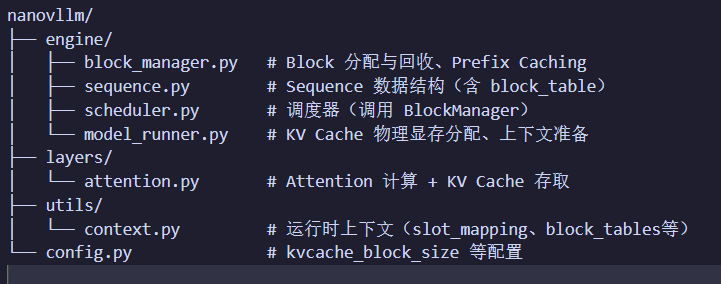
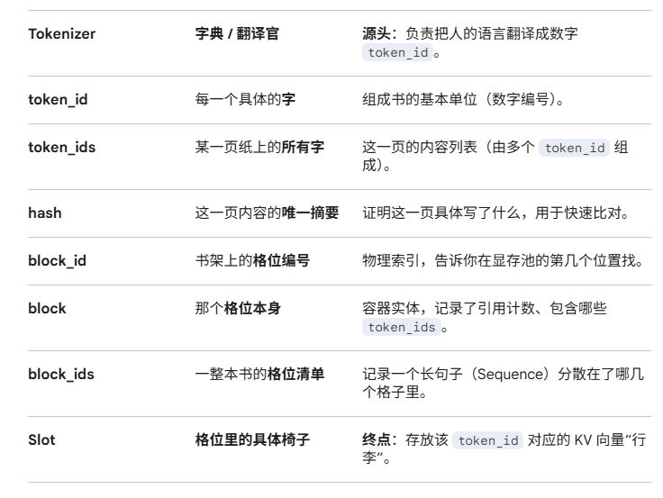
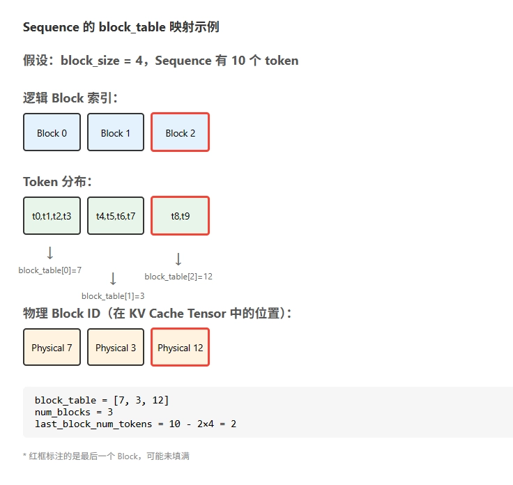

一、文件定位



- ### 1.1模块协作关系图

**核心协作流程**：

1. **Scheduler** 决定哪些 Sequence 参与本次迭代
2. **BlockManager** 为 Sequence 分配/回收 Block，更新 Sequence 的 `block_table`
3. **ModelRunner** 读取 Sequence 的 `block_table`，构造 `slot_mapping` 等上下文信息
4. **Context** 保存运行时上下文，供 Attention 层使用
5. **Attention** 根据上下文读写 KV Cache，完成注意力计算

二、 PagedAttention 核心思想
- ### 2.1PagedAttention 借鉴了操作系统虚拟内存管理的 **分页机制**：

| 操作系统概念 | PagedAttention 类比 |
| --- | --- |
| 页（Page） | Block（固定大小的 KV Cache 块） |
| 页表（Page Table） | Block Table（逻辑位置到物理 Block 的映射） |
| slot | token 级别的物理位置映射 |
| 进程（Process） | Sequence（一个推理请求） |


核心优势：

- **按需分配**：只为实际生成的 token 分配 Block
- **动态管理**：请求结束后立即回收 Block 供其他请求使用
- **支持共享**：相同前缀的请求可共享 Block（Prefix Caching）
- ### 1.1 KV Cache 的内存瓶颈

在 Transformer 架构的大语言模型推理过程中，每生成一个新 token 都需要用到之前所有 token 的 Key 和 Value 向量。为避免重复计算，我们会将这些 KV 向量缓存起来，这就是 **KV Cache**。

KV Cache 的显存占用可以用以下公式估算：

```
KV Cache Size = 2 × num_layers × seq_len × num_kv_heads × head_dim × dtype_size
```

以 Qwen3-0.6B 为例（28层，8个KV头，64维，bf16）：   
-
-
- 进入28层每层8个kv头每个头负责64维度
- 单个请求、序列长度 4096：`2 × 28 × 4096 × 8 × 64 × 2 = 234 MB`
- 如果同时服务 32 个请求：约 **7.34 GB** 显存仅用于 KV Cache
- 如果序列长度为10那就会2 × 28 × 10 × 8 × 64 × 2

传统方案的问题在于**预分配最大长度:**
。假设`max_model_len = 4096`，即使一个请求实际只生成 100 个 token，也会预分配 4096 长度的 KV Cache 空间，
导致永远都是2 × 28 × 4096 × 8 × 64 × 2= 234 MB
**60%-80% 的显存浪费**。此外，不同请求的实际长度参差不齐，容易产生**显存碎片**

Parameters:是权重/参数
kv catch：是缓存
在相同40g显存下 有kv catch的一个 Batch 里塞进更多的请求（从 8 个变成近 40 个），显卡跑一次计算能同时处理更多人的回复。它的每秒生成 Token 数（0.9k）远远超过了橙色箭头（0.3k）。


- ### 2.2 Attention 层的 KV Cache 操作 nanovllm/layers/attention.py

模式 A：笨蛋模式（没有 KV Cache）
- 生成第 1 个字：计算 100 个词的 KV。
- 生成第 2 个字：计算 101 个词的 KV。
- 生成第 3 个字：计算 102 个词的 KV。
- 结果：计算量是 O(N^2)。当你聊到 2000 字时，显卡就得为了吐出一个字而计算几百万次，这种重复劳动会直接让显卡冒烟。

模式 B：天才模式（带 KV Cache）
- Prefill：一次性算出前 100 个词的 KV，存进仓库。
- Decode：吐第 1 个字时，只算这 1 个字的 KV，加上仓库里的 100 个。
- Decode：吐第 2 个字时，只算这 1 个字的 KV，加上仓库里的 101 个。结果：每一轮的计算量几乎是恒定的（只算当前最新的Q, K, V）。

- ### 2.3 Block 类 nanovllm/engine/block_manager.py
- Block 它是“大管家”，手里攥着：房间号 (block_id)、指纹 (hash)、有几个人住 (ref_count)，以及那份名单 (token_ids)。
- block_table 是一个列表（List），由每一个 Sequence（序列）独自拥有。本质：它按顺序记录了一个句子占用了哪些 block_id。
- token_ids 它只是一串数字（比如 [101, 202, 303]），代表这间房里具体存了哪些字。
- token分到的block去free_block_ids领一个空block_id
- 这个空block_id对应着gpu_cache（显存池）哪还有空位就放在哪

核心逻辑
- 不连续存储：通过 block_table，模型以为 KV Cache 是连续的，但其实管家给它的是散落在各处的物理块。
- 按需拿取：像操作系统分配内存页一样，用一个拿一个，而不是一次性预留。
- BlockManager 是 Block 的管理器，负责分配、回收和 Prefix Caching。
- Block 是 PagedAttention 的最小存储单元，代表 KV Cache 中的一个固定大小的槽位。

- ### 2.4 sequence 类 nanovllm/engine/sequence.py
- Sequence 代表一个推理请求，包含 token 序列和 Block 映射信息。
- 先有 Tokenizer 吐出的 token_ids，然后才会有承载这些 ID 的 Sequence 对象
- Tokenizer (翻译官)：它把字符串传进去，吐出一串数字 [101, 202]。这就是 token_ids
- Sequence (集装箱/订单)：你拿着这串数字，去调用 Sequence(token_ids)。这时候，一个 Sequence 对象才正式诞生。


- ### 2.5 KV Cache 物理存储 nanovllm/engine/model_runner.py
* **第一层级：Block**（显存的最小分配单位）
    * **第二层级：Layers**（这块显存必须预留出所有层的空间）
        * **第三层级：KV 对**（每个位置都有 K 和 V）
            * **第四层级：Heads**（每个 KV 对里有 8 个头）
                * **第五层级：Slots**（每个头能装 block_size 个 Token）
                    * **第六层级：Head Dim**（每个 Token 的向量维度，如 128）
-           
- Token 在 Attention 里是被拆分给头的。

- 一个 Token 被劈成了 Heads份。

- 一个 Block 领了block_size个 Token。

- 所以 一个 Block 的每个头，都得负责存这 block_size 个 Token 拆出来的其中一份。

- ## 2.6多头注意力
- 举例8个头的情况
1. 数据* [权重1 + 权重2 + ... + 权重8]（这是一个巨大的矩阵，只需算 1 次）。
2. 假设你的隐藏层维度是 128：计算得到一个长度为 128*8 = 1024的长向量。代码里执行 view(batch, seq_len, 8, 128)。结果：这个长向量被逻辑上切成了 8 段，每段 128 维。
- 这 8 段就是你的 8 个头。 虽然它们来自同一次计算，但因为它们对应大矩阵中不同的列（也就是不同的权重区域），所以它们“看”到的信息是完全不同的。